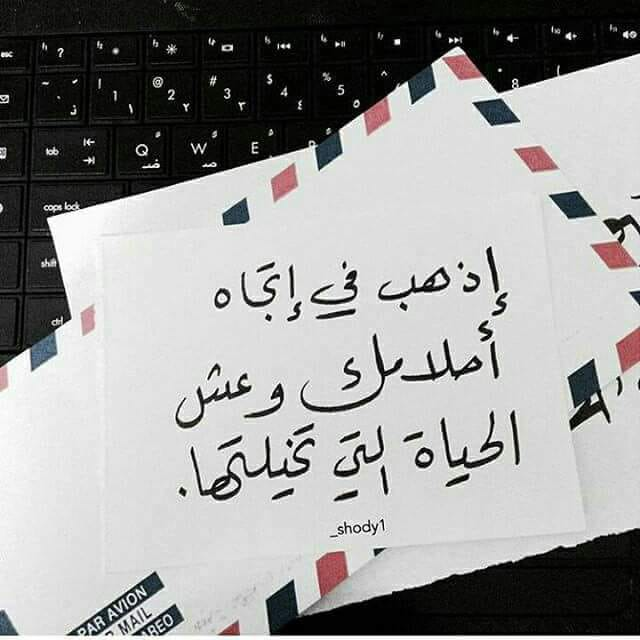

## Hi there 👋

<!--
**danyamuna/DANYAMUNA** is a ✨ _special_ ✨ repository because its `README.md` (this file) appears on your GitHub profile.

Here are some ideas to get you started:

- 🔭 I’m currently working on ...
- 🌱 I’m currently learning ...
- 👯 I’m looking to collaborate on ...
- 🤔 I’m looking for help with ...
- 💬 Ask me about ...
- 📫 How to reach me: ...
- 😄 Pronouns: ...
- ⚡ Fun fact: ...
-->
<h1 align="center">Hi 👋, I'M DANYA MUNA</h1>

Full Stack Developer | Software Engineer

## 👨‍💻 About Me

🎓 I graduated from Telecommunications Engineering. 
💻 Passionate about Full Stack Development / Backend /c++ 
🚀 Interested in Software Engineering   

---

🛠️ Skills & Tools

---

<h2 align="center">Thanks for Visiting my GitHub Profile!</h2>

---

  

---

  

<h2> 🔗 Connect With Me </h2>
  

<!--

--!>
  

---
